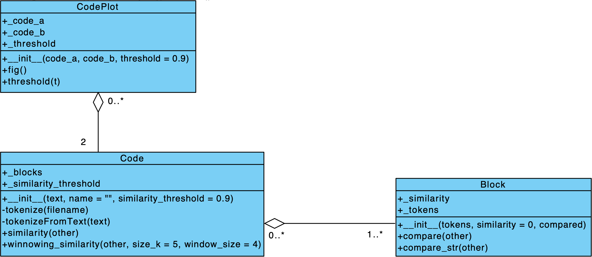

# Pygiator - Plagiatfinder

Mit dem Pygiator kann man zwei Python-Skripte vergleichen und dabei feststellen ob es sich um ein Plagiat handelt. Dieses Programm wurde im Zuge der Lehrveranstaltung **Skriptsprachen** entwickelt. Die Anforderungen dabei waren:

+ zwei Eingangsparameter - die beiden Pythonskripte
+ ein Ausgangsparameter - die Ähnlichkeit

---

## Installation und Anforderungen

Um den Pygiator lokal laufen zu lassen ist es erforderlich, dass [Python 3.8 oder höher](https://www.python.org/) installiert ist. Das Projekt selbst findet man auf Github unter https://github.com/qtr1ck/pygiator und enthält alle erforderlichen Dateien. Es müssen in der Regel auch weitere Module installiert werden, dafür liegt die **requirements.txt** Datei bereit. Die Installation dieser erfolgt durch die Eingabe von folgendem Kommando:

```bash
pip install -r requirements.txt
```

Nachdem die erforderlichen Module installiert sind, kann der Pygiator gestartet werden. Dafür sollte ein Terminal im Root Ordner des Pygiators geöffnet werden oder man navigiert innerhalb des Terminals dort hin. Anschließend kann die Anwendung mit nachfolgendem Kommando gestartet werden und ein Browserfenster mit der laufenden Anwendung sollte sich öffnen.

```bash
streamlit run streamtlit_app.py
```

Möchte man ohne großen Aufwand den Pygiator verwenden und die Installation von Python ist bereits ein großes Hindernis, so kann dieser auch unter https://share.streamlit.io/qtr1ck/pygiator/main abgerufen werden. Dafür sind lediglich eine aufrechte Internetverbindung und ein Browser erforderlich.

---

## Verwendung

In der Seitenleiste befinden sich zwei Felder. Durch einen Klick auf diese öffnet sich ein neues Fenster, in welchem die Python-Dateien ausgewählt werden können. Sobald zwei Skripte ausgewählt wurden, erfolgt die Berechnung der Ähnlichkeit und das Resultat wird in Prozent angezeigt. Zusätzlich erfolgt eine Darstellung beider Code-Strukturen, sowie der Ähnlichkeit je Block als Heatmap.

Sobald ein Resultat vorliegt, kann das Ergebnis mit einem Slider in der Seitenleiste weiter angepasst werden. Dabei wird durch den Benutzer ein Grenzwert ausgewählt. Alle Code-Blöcke welche diesen Grenzwert überschreiten, werden als Plagiat erachtet und in der Darstellung entsprechend rot eingefärbt.

Desweiteren können die beiden Dateien vertauscht werden, links über der Heatmap befindet sich eine Checkbox, durch Aus- bzw. Abwählen werden sie dabei vertauscht.

Als zusätzliches Verfahren steht noch der ***Winnowing Algorithmus*** zur Verfügung. Dessen Resultat kann durch Klicken auf den Infotext *Similarity using Winnowing Algorithm* eingeblendet werden. 

---

## Implementierung

### Lösungsidee

Da der Quellcode an sich schwer zu analysieren ist, muss dieser aufbereitetet werden, in diesem Fall bietet es sich an, den Code in Tokens umzuwandeln. Der Code wird
dabei in seine Bestandteile zerlegt, indem jedes *Wort* einer der folgenden Kategorien zugeordnet wird:

```bash
categories = {
    'Call':         ['A', 'rgb(80, 138, 44)'],
    'Builtin':      ['B', 'rgb(212, 212, 102)'],
    'Comparison':   ['C', 'rgb(176, 176, 176)'],
    'FunctionDef':  ['D', 'rgb(4, 163, 199)'],
    'Function':     ['F', 'rgb(199, 199, 72)'],
    'Indent':       ['I', 'rgb(237, 237, 237)'],
    'Keyword':      ['K', 'rgb(161, 53, 219)'],
    'Linefeed':     ['L', 'rgb(255, 255, 255)'],
    'Namespace':    ['M', 'rgb(232, 232, 209)'],
    'Number':       ['N', 'rgb(192, 237, 145)'],
    'Operator':     ['O', 'rgb(212, 212, 212)'],
    'Punctuation':  ['P', 'rgb(214, 216, 216)'],
    'Pseudo':       ['Q', 'rgb(14, 3, 163)'],
    'String':       ['S', 'rgb(194, 126, 0)'],
    'Variable':     ['V', 'rgb(184, 184, 176)'],
    'WordOp':       ['W', 'rgb(8, 170, 207)'],
    'NamespaceKw':  ['X', 'rgb(161, 53, 219)']
}
```

Kommentare und Leerzeilen spielen bei der Ähnlichkeitsanalyse keine Rolle und werden entsprechend ignoriert.  
Nachdem die Tokenstrings für die beiden Skripte vorliegen, efolgt der Vergleich dieser über zwei verschiedene Methoden.

#### Methode 1: Blockweiser Vergleich über Difflib

---

Da die Programmiersprache Python große Freiheit bei der Anordnung von Programmblöcken lässt, ist es sinnvoll einen blockweisen Vergleich durchzuführen. Jeder Block eines Codes A wird dabei mit allen Blöcken eines Codes B abgeglichen. Es wird dabei immer nur die größte gefundene Ähnlichkeit als Resultat für den aktuellen Block übernommen. Für den Vergleich wird der ***SequenceMatcher*** aus dem Modul ***difflib*** verwendet. Dieser verwendet die Levenshtein Distanz zur Berechnung der Ähnlichkeit zweier Strings und gibt diese als Wert zwischen 0 und 1 zurück.  
  
Die Ähnlichkeit für den gesamten Code ergibt sich aus:  
(Gesamtlänge der als Plagiat erachteten Blöcke) / (Blocklängen Total)

#### Methode 2: Vergleich unter Nutzung des Winnowing Algorithmus

---

Durch die Kombination eines Hashing-Verfahrens, sowie eines Sliding-Windows wird ein Fingerabdruck für einen gesamten Source-Code erstellt. Dabei wird der bereits vorverarbeitete Code verwendet. Der Fingerabdruck eines Dokuments besteht aus einem Set von Hashwerten. Um die Ähnlichkeit zweier Source-Codes zu erhalten, kann der Jaccard-Koeffizient herangezogen werden.  
  
Jaccard-Koeffizient:  

  
Für die Implementierung wurde das Paper [Winnowing: local algorithms for document fingerprinting](https://theory.stanford.edu/~aiken/publications/papers/sigmod03.pdf) herangezogen.

### Backend

Für die Logik wurden unter anderem die beiden Klassen *Block* und *Code* erstellt. Die Erstere wird dabei genutzt um die Bestandteile eines Code-Blockes in Form von Tokens zu repräsentieren. Außerdem kann die Ähnlichkeit, welche beim Vergleich mit einem anderen *Block* Objekt festgestellt wurde, in jeder Block-Instanz festgehalten werden.  

Die Klasse *Code* sorgt dafür, dass ein beliebiges Skript in Form von einzelnen Blöcken abgespeichert wird. Außerdem bietet sie weitere Funktionalitäten und Methoden, wie in etwa jene um die Ähnlichkeit zweier *Code* Objekte zu erhalten. Dabei gibt es einmal die Möglichkeit diese blockweise zu ermitteln, oder über alle Blöckke hinweg mittels Winnowing Algorithmus.

Desweiteren wurde für die Heatmap auch eine Klasse erstellt. Diese verarbeitet zwei *Code* Objekte und bildet die Tokens in unterschiedlichen Farben ab. Zudem kann man auch einen Grenzwert übergeben, mit welchem die Abbildung des ersten *Code* Objekts angepasst wird. Dabei werden jene Blöcke in welchen die Ähnlichkeit den Grenzwert überschreitet, mit roter Farbe überlagert dargestellt.

Klassendiagramm:



### Frontend

Das Frontend wurde mit [**Streamlit**](https://www.streamlit.io/) umgesetzt. Streamlit ist eine Python Bibliothek, mit welcher Web Applikationen auf Basis von Python sehr einfach erstellt werden können. Um es verwenden zu können muss nur das entsprechende Modul
installiert sein. Diese Bibliothek bietet bereits die entsprechenden Funktionalitäten um Texte, Diagramme oder auch Widgets abzubilden.

Der Pygiator ist dabei in drei Bereiche unterteilt:

+ Seitenleiste
+ Startseite
+ Ergebnisseite

Sobald zwei Dateien ausgewählt sind, wird die Ergebnisseite angezeigt. Dort befindet sich ganz oben ein Dropdown Menü für den **Winnowing** Algorithmus, in ausgeklappten Zustand kann man dort die Parameter dafür anpassen und sieht auch das Ergebnis davon.
